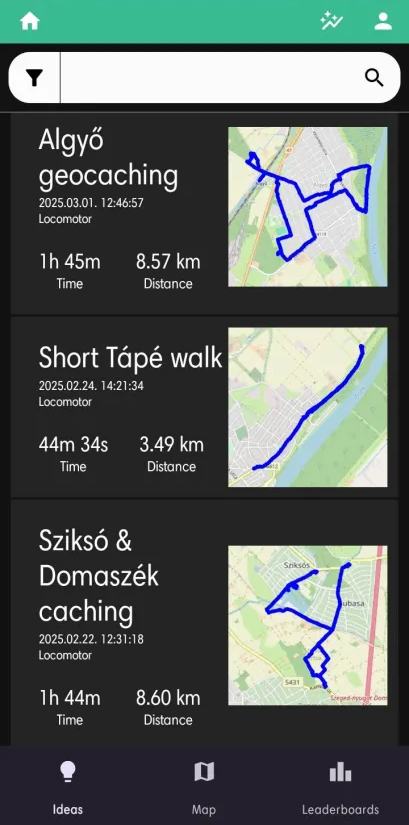
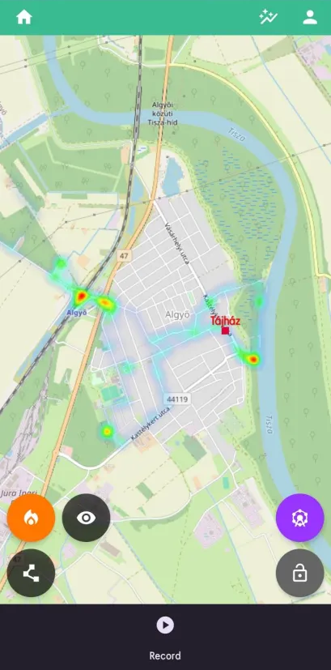
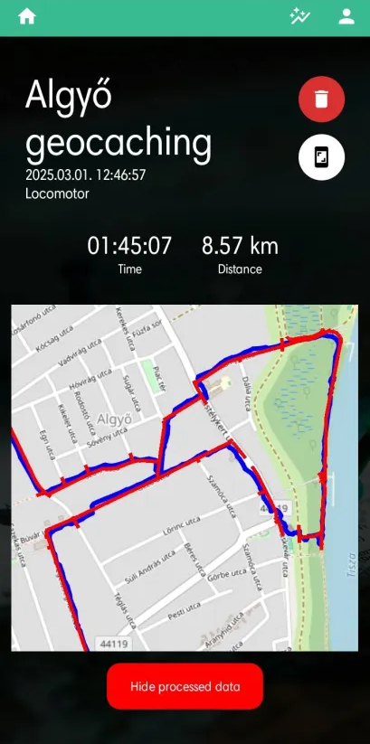
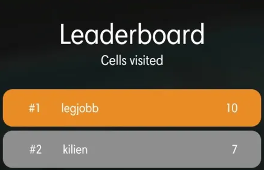
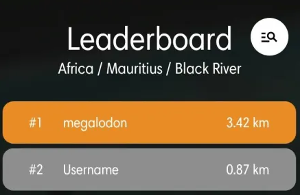

# Find what you haven't seen with Sightseek
Sightseek is a mobile application that motivates you to visit new places.

  
  
  

## Features
- Record and manage your activities
    - Additionally you can import activities from Strava
- Heatmap
- Statistics in both shareable and detailed forms
- Find, save and view attractions on the map
- Leaderboards
- Language support for English, Hungarian, German and Japanese

## Find your way to the top of the leaderboard
Sightseek has two leaderboards available:
- Cell based
    - Earth is divided into 32768 cells, try to visit as many as you can!
- Region based
    - Want to be the very best in your region? Walk on unique paths and the distance will determine your placing.

  
  

## Limitations
The application is a proof of concept created for my Bachelor thesis.

The spatial algorithms run entirely locally and are restricted to a select few locations to prevent the application's file size from skyrocketing. This will be worked on in the future.

Documentation is not yet available.